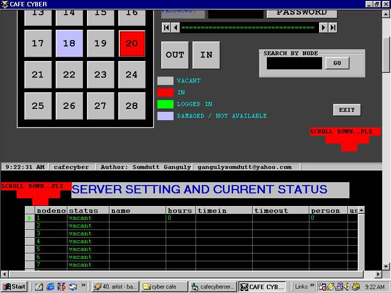



## cyber cafe management \(cafe cyber

### Description

This is a exciting project on cyber cafe management...it is a great example of network programming...The entire process is automatic....u can manage upto 28 clients in a n/w using this software....user's are shown the time left and other informa in their screen...they are assigned username and random password for authentification....unique gui...backup...etc..etc............just vote for me!
 
### More Info
 

             |
---                |---
**Submitted On**   |2002-01-04 10:35:06
**By**             |[pompyk](https://github.com/Planet-Source-Code/PSCIndex/blob/master/ByAuthor/pompyk.md)
**Level**          |Advanced
**User Rating**    |4.5 (200 globes from 44 users)
**Compatibility**  |VB 6\.0
**Category**       |[Complete Applications](https://github.com/Planet-Source-Code/PSCIndex/blob/master/ByCategory/complete-applications__1-27.md)
**World**          |[Visual Basic](https://github.com/Planet-Source-Code/PSCIndex/blob/master/ByWorld/visual-basic.md)
**Archive File**   |[cyber\_cafe70040482002\.zip](https://github.com/Planet-Source-Code/pompyk-cyber-cafe-management-cafe-cyber__1-33603/archive/master.zip)

